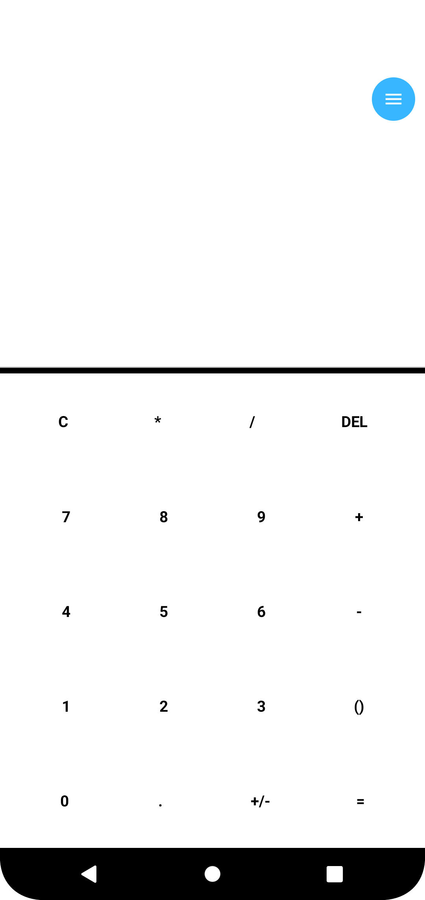
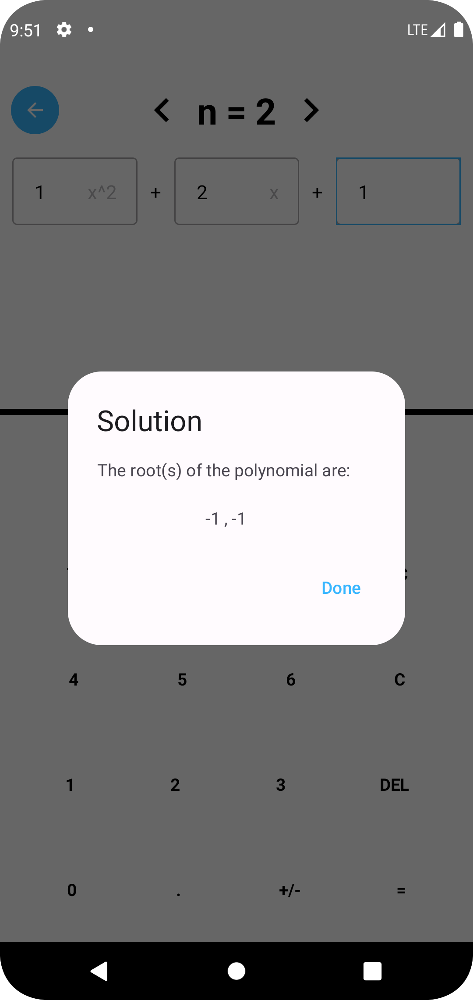
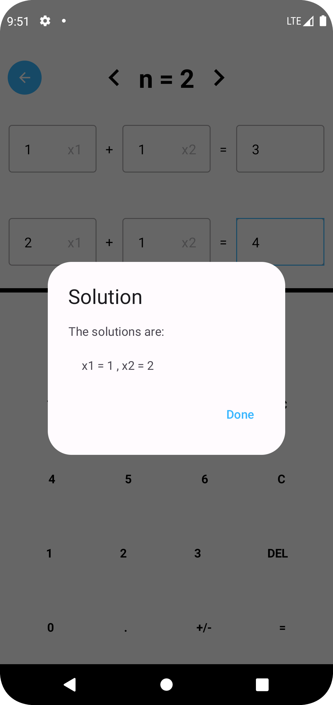
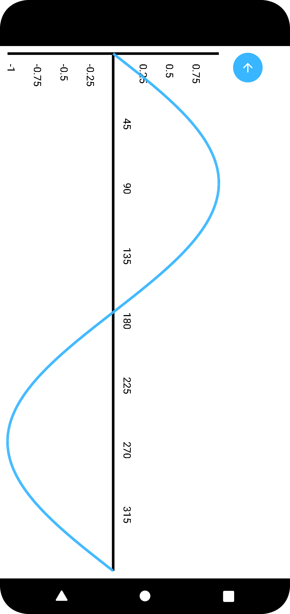

# Advanced Calculator


Advanced Calculator is a native Android app built with Kotlin and Jetpack Compose. It provides a versatile calculator with features ranging from simple arithmetic calculations to advanced scientific functions, polynomial root finding, solving systems of linear equations, generation of a table of values for functions, and function plotting.

## Features

- Simple arithmetic calculations
- Scientific calculations
- Polynomial root finding
- Solving systems of linear equations
- Generation of a table of values for functions
- Function plotting

## Project Structure

- **composable_functions:** Contains UI components commonly used in the application.
- **controllers:** Contains controllers for calculations performed with user input.
- **extensions:** Contains function extensions to various objects.
- **models:** Contains data classes used throughout the application.
- **pages:** Contains application's UI screens.

## Getting Started

To get started with Advanced Calculator, follow these steps:

1. Clone the repository:

   ```bash
   git clone https://github.com/kaycee-okoye/advanced-calculator.git
   ```

2. Open the project in Android Studio.

3. Build and run the app on an emulator or physical device.

<p>
   &nbsp
   &nbsp
   &nbsp
  
</p>

## Contribution Guidelines

Please read our [contribution guidelines](CONTRIBUTING.md) before contributing to the project.

## License

This project is licensed under the GPL License - see the [LICENSE](LICENSE.md) file for details.

## Support

If you have any questions or issues, please [open an issue](https://github.com/kaycee-okoye/advanced-calculator/issues).

---

Happy Coding! 🚀